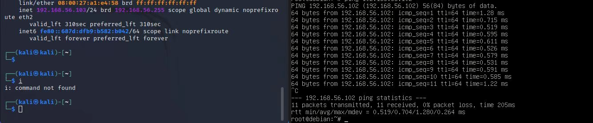
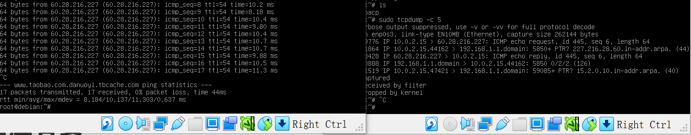

# 网络安全第一次实验：基于 VirtualBox 的网络攻防基础环境搭建

## 实验目的

- 掌握 Virtual Box 虚拟机的安装与使用；
- 掌握 Virtual Box 的虚拟网络类型和按需配置；
- 掌握 Virtual Box 的虚拟硬盘多重加载；

## 实验环境

以下是本次实验需要使用的网络节点说明和主要软件举例：

- VirtualBox 虚拟机
- 攻击者主机（Attacker）：Kali 
- 网关（Gateway, GW）：Debian 
- 靶机（Victim）：xp-sp3 / Kali / Debian

## 实验要求

- 虚拟硬盘配置成多重加载；

- 搭建满足如下拓扑图所示的虚拟机网络拓扑；


> 根据实验宿主机的性能条件，可以适度精简靶机数量

- 完成以下网络连通性测试；

  -  靶机可以直接访问攻击者主机
  - 攻击者主机无法直接访问靶机
  - 网关可以直接访问攻击者主机和靶机
  - 靶机的所有对外上下行流量必须经过网关
  - 所有节点均可以访问互联网

  ## 实验步骤

  ### 1.配置虚拟硬盘多重加载

  虚拟机配置步骤图示如下：

  1. VirtualBox虚拟机管理 -> 虚拟介质管理
  2. 选中所需的虚拟盘，将属性 -> 类型修改为多重加载后应用
  
  

###      2.搭建虚拟机网络拓扑

####      打开每台虚拟机，在设置中进行网卡的配置

- **Gateway网关**网卡配置（需要4块网卡）
  - 网卡1：NAT网络；
  - 网卡2：主机（Host-Only）网络；
  - 网卡3：内部网络intnet1，搭建局域网1；
  - 网卡4：内部网络intnet2，搭建局域网2。
  - 在该界面对网卡依次进行设置，如下所示：


- **Attacker攻击者**（需要3块网卡）
  
  - 网卡1：NAT网络；
  - 网卡2：主机（Host-Only）网络；
  - 网卡3：主机（Host-Only）网络；（与网卡2不同）
  
  
  
- **其它的实验受害主机**都只需要一块网卡
  
  - 将victim分为两组，不同的实验受害主机在不同的局域网里；
  - Windows xp1 与 kali 2号在第一局域网（intnet1）； 
  
  
  
  
  
  - Windows xp2 与 debian 2号在第二局域网（intnet2）；
  
  
  
  

### 3.开始进行主机间的互联

- 测试**第一局域网（intnet1）**内的主机与Attacker的连通性

  - 局域网1内的靶机可直接访问Attacker

    

  - 攻击者Attacker不可直接访问局域网1内的靶机

  

- 测试**第二局域网（intnet2）**内的主机与Attacker的连通性

  - 局域网2内的靶机可直接访问Attacker

    

  - 攻击者Attacker不可直接访问局域网2内的靶机

    

- 测试**网关**可以直接访问攻击者主机和靶机

  - 网关访问攻击者Attacker

    

  - 网关访问第一局域网（intnet1）靶机

    

  - 网关访问第二局域网（intnet2）靶机

    

### 4.验证靶机的所有对外上下行流量必须经过网关

**验证原理：**让靶机与互联网进行互通，在互通的过程中通过网关进行抓包。若靶机发送的所有包都能被网关抓到，则说明靶机的所有对外上下行流量必须经过网关。

- 第一局域网（intnet1）靶机
  - 联通互联网并用网关抓包
  - 抓包语句：`sudo tcpdump -c 5`
  
  
  
- 第二局域网（intnet2）靶机
  - 联通互联网并用网关抓包
  - 抓包语句：`sudo tcpdump -c 5`
  
  
  
- 将数据文件进行抓包，之后通过scp复制到主机并用WireShark进行分析


```bash
# 安装tcpdump
apt install tcpdump
apt update && apt install tmux

# 抓包
cd workspace
tcpdump -i enp0s9 -n -w 20210908.1.pcap
```


### 5.所有节点均可以访问互联网

- 攻击者Attacker可正常访问互联网


- 局域网1（intnet1）靶机可正常访问互联网


- 局域网2（intnet2）靶机可正常访问互联网


- 网关gateway可正常访问互联网


## 实验遇到的问题与解决方案

1. 在虚拟机网络配置中，NAT网络无法指定界面的名称。在网上查找资料后发现，通过设置虚拟机网络中的全局设定，添加NatNetwork后该报错得以解决。

2.实验过程中，部分虚拟机无法正常打开。彻底删除掉所有文件后，进行重新导入，并修改系统处理器数量和显示中的显存大小和缩放率，之后可以正常打开。

3.在进行主机互联时，有时候总是ping不通。在网上查阅资料后，了解到需要先将虚拟机的防火墙关闭。

## 参考链接

https://blog.csdn.net/hexf9632/article/details/110197530

https://mbd.baidu.com/ma/s/nShWHTqN

https://mbd.baidu.com/ug_share/mbox/4a83aa9e65/share?product=smartapp&tk=6fb1d6b78c1d292828b2879ba49711cc&share_url=https%3A%2F%2Fyebd1h.smartapps.cn%2Fpages%2Fblog%2Findex%3FblogId%3D126253169%26_swebfr%3D1%26_swebFromHost%3Dbaiduboxapp&domain=mbd.baidu.com

